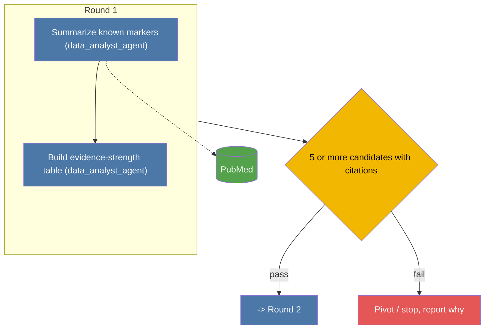
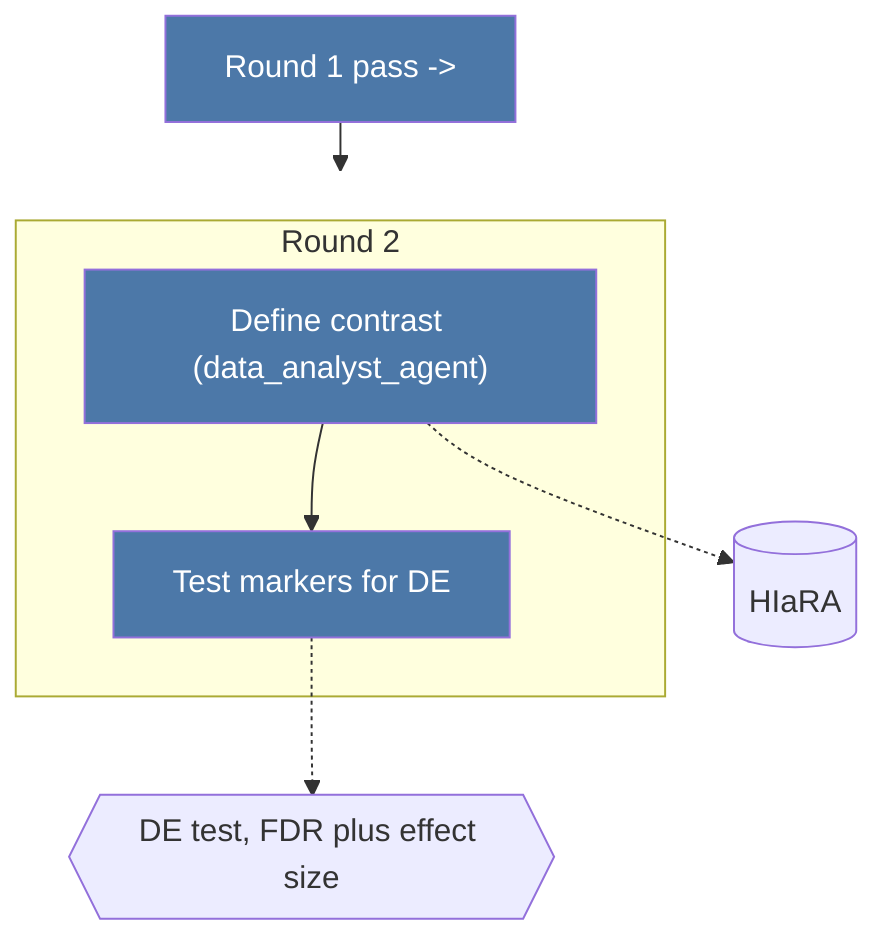

To structure a plan as **hierarchical/staged rounds**, not a flat list of steps to execute all at once. Each round: a stated pass/fail threshold, and explicit branches for what happens next on each outcome. Don't commit later-round steps until the threshold for the round before it is defined.

Render the rounds and branches as a mermaid flowchart, with **one small node per step** (not a checklist crammed into a single round node) grouped under a `subgraph` per round, and the pass/fail threshold as a decision diamond after each subgraph. Each step node's label is just the step name + agent, e.g. `["Summarize known markers (data_analyst_agent)"]` — no ` `, no bullet lists, no bold markdown inside labels. Datasets and analytical methods a step uses are separate nodes, linked to that step with a dotted edge (`-.->`), not text inside the step's label. Color node types with `classDef` (step / decision / dataset / method / stop) so the diagram reads by shape+color, not by parsing paragraphs of text.

**One `mermaid` code block per round (hard requirement):** never put all rounds in a single combined graph — with several steps and dataset/method nodes per round, one wide graph overflows the screen in most markdown viewers (VS Code preview included), which have no pan/zoom. Each round is its own fenced diagram; the link to the next round is a plain entry/exit node (`PREV2["Round 1 pass ->"]`, `NEXT1["-> Round 2"]`), not a cross-diagram edge. Detail that doesn't fit in a short node label (rationale, sub-bullets, caveats) goes in prose under the diagrams, referenced by step ID — not stuffed back into the node.

**Mermaid rendering rule (hard requirement):** always wrap every node/diamond label in double quotes (`D1{"..."}`, `R1["..."]`), never leave a label unquoted. Inside labels, prefer plain ASCII over special characters — write "3 or more" instead of "≥3", "less than" instead of "<" — even when quoted, since some renderers still choke on `()`, `≥/≤`, or `?` mixed with ` ` in node text. Example shape:

Keep each step node's label to a few words — anything longer (rationale, sub-bullets) belongs in prose under the diagram, referenced by step ID (S1a, S2b, ...), not inside the node.
