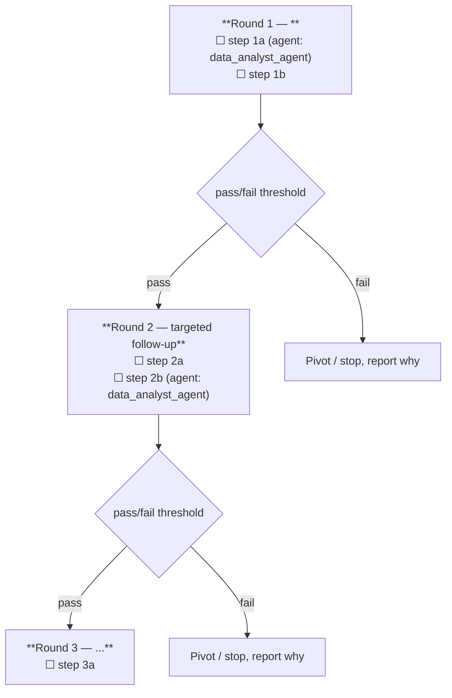

# Study design

How to lay out a study — the role a PI plays when designing an experiment. The orchestrator does this directly (no delegation): at the start of every task, and again whenever a cycle needs re-design.

## Orientation
Check these resources before drafting a design:

**CRITICAL**: do not limit yourself to local resources. If a question requires additional data, check public databases via the enabled tools. If it requires a custom method, plan to develop it.

**Public-data accountability.** For every pillar in the design, name which public/external resources were considered (CellxGene, GWAS Catalog, DepMap, ChEMBL, etc.) and state explicitly either "checked — used, see Round X" or "checked — excluded, because Y." Do not omit a resource without a stated reason; an unstated omission is treated as not having checked.

## How to appraoch?

## 1. A deep dive to the data
Read one of these depending on the question:
  - `knowhow/drug_repurposing.md`
  - `knowhow/disease_implication.md` -> to find markers associated with disease/aging/condition.
as well as available data locally and online:
- Locally data -> `datalake.md`
- Online data: #TODO: fix this

**CRITICAL** check `knowhow/statistics.md` in carefull analysis of your design.

## 2. Critical thinking and planning and evaluation of deliverable
- **Validation strategy**
  1. **Replication/validation** — an independent / held-out dataset or cohort
  3. **Literature concordance** — known biology / prior reports

## 3. Formatting
Structure as **hierarchical/staged rounds**, not a flat list of steps to execute all at once. Each round: a stated pass/fail threshold, and explicit branches for what happens next on each outcome. Don't commit later-round steps until the threshold for the round before it is defined.

Render the rounds and branches as a mermaid flowchart, with each round's steps as an inline checklist (`☐`, ` `) inside its node and the pass/fail threshold as a decision diamond — chart structure plus checklist content in one diagram. Subagent assignments go in the checklist lines.

**Mermaid rendering rule (hard requirement):** always wrap every node/diamond label in double quotes (`D1{"..."}`, `R1["..."]`), never leave a label unquoted. Inside labels, prefer plain ASCII over special characters — write "3 or more" instead of "≥3", "less than" instead of "<" — even when quoted, since some renderers still choke on `()`, `≥/≤`, or `?` mixed with ` ` in node text. Example shape:

## Design-review revision (pre-execution)
If `peer_reviewer_agent` (DESIGN-REVIEW mode) returns `REVISE-DESIGN` issues, fix the draft per those issues directly. This is a quick pre-execution tightening, not a re-run.

## Re-design pass (post-results)
When a results cycle returns `REVISE` (not a fresh request), read the existing plan and `peer_review.md`, and produce a **delta** — only the additional/changed numbered steps and any updated evaluation criteria needed to close that specific gap. Do not restart the whole study. Do not repeat analyses already recorded as done in `peer_review.md`.

## Keep it tight
`HARD RULE`: keep a design to ≤2000 words. If missing information blocks the study, surface that to the user and stop instead of guessing.
